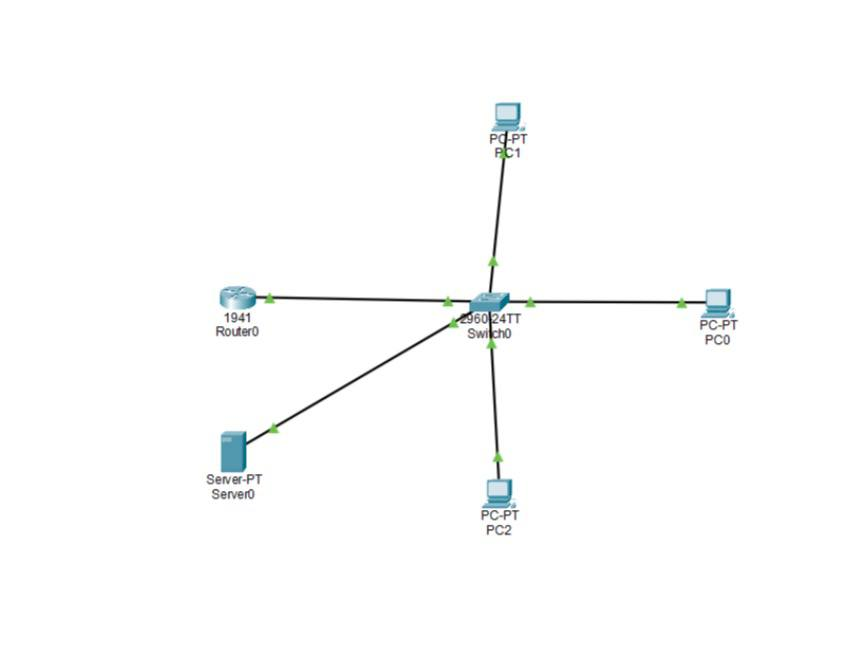
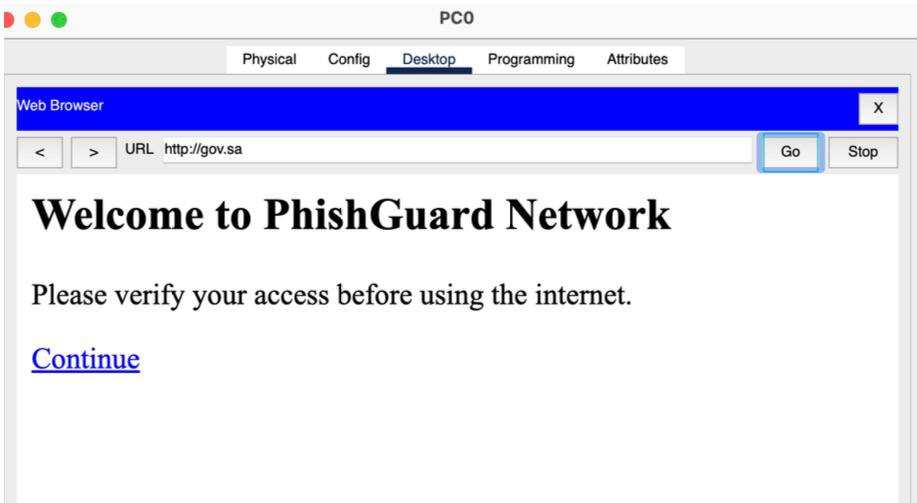
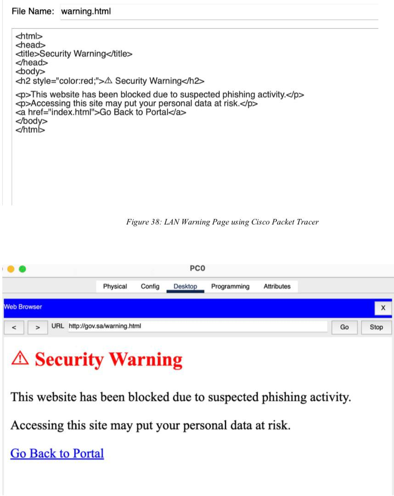

# PhishGuard KSA

### Network-Level Phishing Detection System

PhishGuard KSA is a graduation project developed to enhance protection against phishing attacks through network-level security controls.

The system combines DNS filtering, domain whitelisting, user authentication, and a simulated LAN environment to help detect and prevent access to phishing websites.

## Key Features

- DNS Filtering and Domain Whitelisting
- Phishing Website Detection
- OTP-Based Authentication
- Captive Portal
- Phishing Warning Page
- Security Logging
- LAN-Based Network Protection

## Network Architecture

The network environment was designed and implemented using Cisco Packet Tracer.

The simulated LAN includes:

- Router
- Switch
- DNS/HTTP Server
- Multiple Client PCs

The network configuration was used to simulate and test legitimate and phishing website access within a controlled environment.

## Technologies & Tools

### Network Implementation
- Cisco Packet Tracer
- LAN Networking
- DNS Configuration
- HTTP Server Configuration
- Network Testing and Troubleshooting

### Other Project Technologies
- Python
- Flask
- PyOTP
- HTML

The Python-based components were developed as part of the overall team project. My primary responsibility was the Cisco Packet Tracer network design and implementation, while I maintained an understanding of how the software components integrated with the network environment.

## My Contribution

I was responsible for the network design and implementation of the project using Cisco Packet Tracer.

My contributions included:

- Designing the complete LAN topology.
- Configuring the router, switch, servers, and client devices.
- Configuring IP addressing and network connectivity.
- Setting up and configuring DNS services.
- Implementing DNS filtering and trusted-domain access.
- Configuring HTTP services within the simulated network.
- Testing network connectivity between devices.
- Testing legitimate and phishing website access scenarios.
- Troubleshooting network configuration and connectivity issues.

## Cisco Packet Tracer Implementation

The Cisco Packet Tracer network implementation used in the project is included in this repository.

**File:** `GP2-implementation.pkt`

The file contains the network topology and configurations used to simulate and test the network-level components of PhishGuard KSA.

## Project Type

**Graduation Project**

Bachelor's Degree in Information Technology  
Princess Nourah bint Abdulrahman University
## Project Demonstration

### 1. Network Topology
The LAN topology was designed and implemented using Cisco Packet Tracer.

### 2. Captive Portal
The simulated network redirects the user to the PhishGuard portal before accessing network resources.

### 3. DNS / Blocked Domain Test
Testing unauthorized domain access demonstrates the DNS filtering behavior within the simulated network.

### 4. Security Warning Page
A security warning page is displayed to alert users when suspicious or phishing-related access is detected.

